# Europe Quiz

Welcome to my second project, the Europe quiz website is a landing page for people who like quizzes and are motivated to test or improve their knowledge about European countries and its capitals.

By providing multiple choice questions and enabeling slight adjustments of the game settings the user is encouraged to play. A timer makes sure that the user is focused and at the same time it motivates for improvement since the speed of answering is represented in the final score. 

Target groups of this game are students and every other people who like to extent their knowledge about Europe.

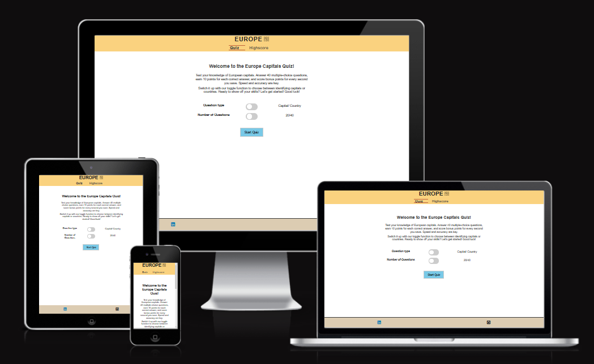

## Features

### Navigation

The navigation bar consists of two links - quiz and highscore. The quiz is the most prominent feature therefore, it appears already on the landing page.
Due to responsive design requirements the behaviour and position of the navigation bar is slightly different for different devices. I.e. there is an hover effect for the desktop version on mobile not.

Mobile view: Elements are aligned to the center. The burger tab is not needed and not used. The multiple choice answers are organized on top of each other by using the standard div logic.

Tablet view: Elements are aligned to the center. Toggle is not used, hover effect is available.The multiple choice answers are organized in a row. 
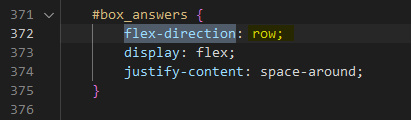

Desktop view: Elements are aligned to the center. Toggle is not used, hover effect available. The multiple choice answers are organized in a row. 

There are three media query breakpoints used: (320px), 768px, 992px

### The header elements
Title and logo are above the navigation. The title says EUROPE and the logo ends the title with letters Q, U, I and Z in a box. Depending on the media query the navigation gets slightly bigger (font-size: 110%). The content in the header is consistent through all three html. pages. It contains two links and a styling for the active site. The header is fixed to the top.

### The main elements
The main elements differ in each html. It is positioned via top-margin: 100px. In the following all features of the three pages are described.

### index.html
The landing page contains a short introduction, the game settings and the "start quiz" button for the quiz.
In connection the first question appears with a multiple choice of three options.

#### Desktop view
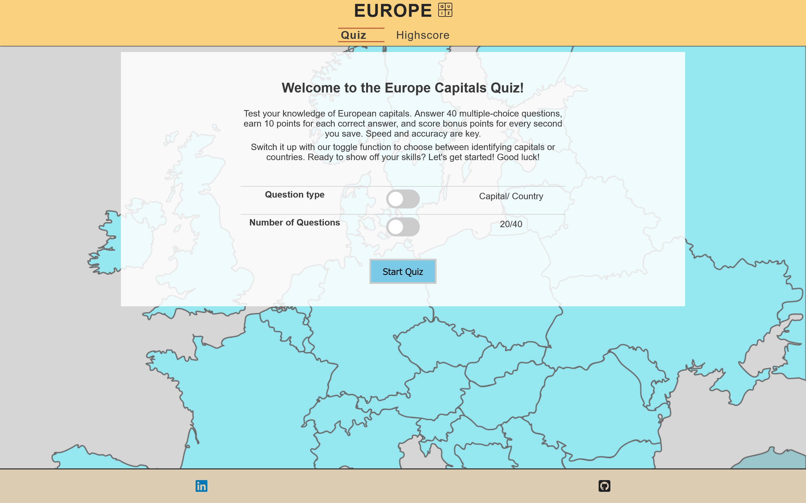

#### Tablet view
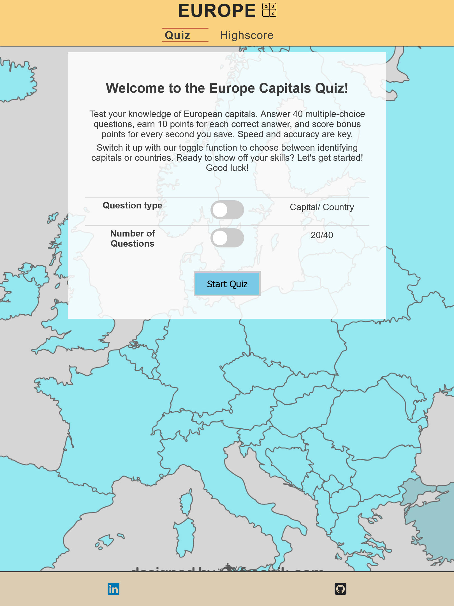

#### Mobile view
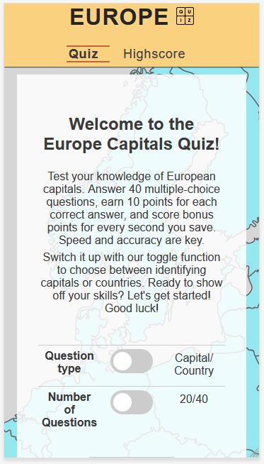

#### Features:

| Feature | Description  | images |
| --- |------------- | ------------- |
| Slider | The slider enables the user to quickly define and change his game experience. He can choose between 20 and 40 questions which takes care of the users time schedule and he can decide whether he has to guess the correct capital or country. The visual effect is generated by using css and due to the position active or deactivated the function saveModeSettings() applies the relevant rule | 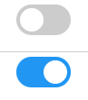 |
| Button to start quiz | By pressing the button the function start_quiz() is initiated. As a consequence of the div 'quiz settings' (containing sliders) disappears by using style.visibility = 'hidden'. The question and multiple choice questions are generated based on the input of the user. | 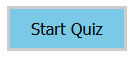 |
| Shuffle function | To keep up the interest and challenge of the user every new round the order of the questions is random by using the Fisher-Yates shuffle algorithm. In addition, it is reused again for shuffling the multiple choice answers to avoid also here a consistency.|  |
| Timer | To challenge the user even more there is a timer which starts to count down from 20 seconds after each questions. When the counter counts ti 0 the game is over. In addition, the user gets additional points for each saved second. This encourages the user to speed up and get rewarded. | 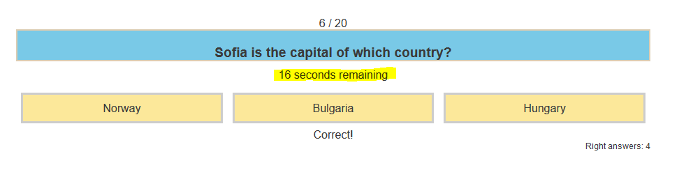 |
| Feedback | After each selected answer the user gets a feedback whether the answer was correct or incorrect. This helps to learn the correct answer. | 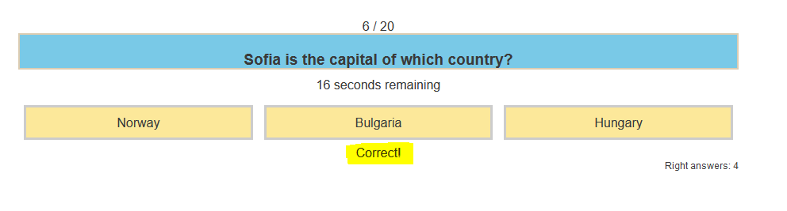 |
| Question counter | Through the game the user sees the number of correct questions. | 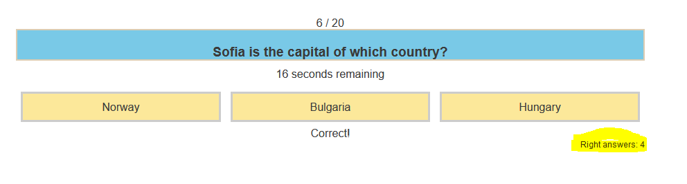 |

html.html

### end.html

#### Features

| Feature | Description  | images |
| --- |------------- | ------------- |
| Input field for user's name | At the end of the game the user can save his score. For that an input field is provided to put in his name. By using trim() a string with whitespace stripped from the beginning and end of the string is returned.| 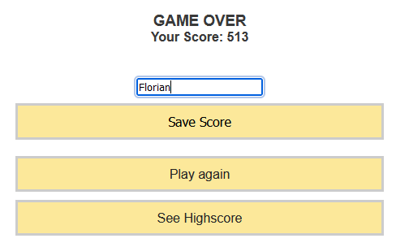 |
| Save user's highscore and name | At the end of the game the user can save his score. The highscore is counted in script.js and storaged together with the user's name in local storage by using function saveHighScore(event). Since the localStorage is limited it only enables the user to see the highscores which are storaged in his own browser. Therefore, it is not possible to compare the results with players who play with another browser. Only results of players using the exact same browser see their results in the game. Once the cache is deleted, the highscores are gone. | see above |
| Disable save button | To avoid that the score is saved without name, the save score button is disabled as long as the input field is empty .| 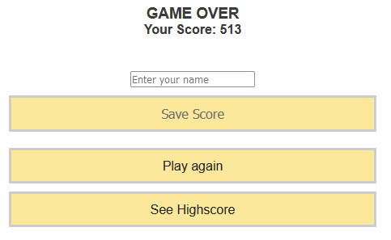 |

end.html

### highscore.html

#### Features
| Feature | Description  | images |
| --- |------------- | ------------- |
| Top 10 |  and by using highScores.splice(10); the max number of 10 list items is generated. | see below |
| Best at the top | There is a list which collects all users and highscores. It is sorted from top to bottom each time when a new entry is added. | see below |

highscore.html
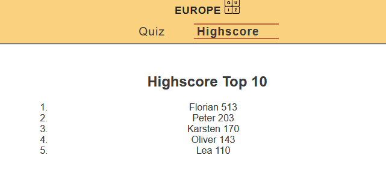

### The Footer
The footer contains a link to the creator's GitHub and Linkedin link. It is fixed to the bottom.

## UX Design
Colorful, plain and simple design. Show a map in the background to introduce the user to the topic - it's geography. The colors of a classic map are used.

 The design was created as a series of wireframes covering mobile, tablet and desktop to determine the initial design and layout of the site.

### Color Scheme
The colors used are mostly aligned with the background and typical colors used on a geographical map. Blue for water, beige for landscape and red, grey for cities and borders. The text color is dark grey and black to provide a user-friendly contrast.

background and element colors
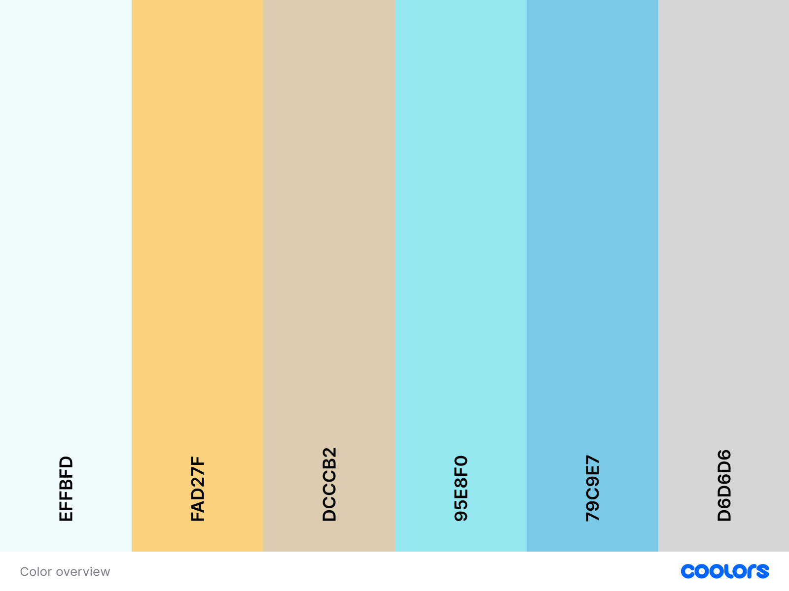

Font color
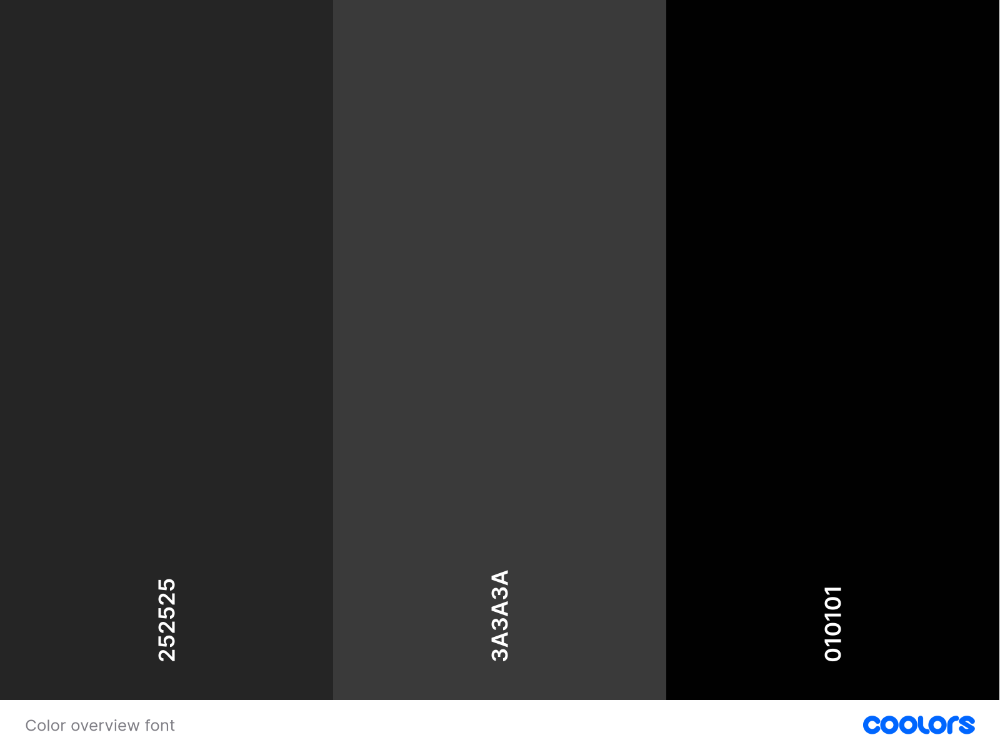

I used coolors.co to generate my colour palette.

### Typography

- I used the Google Font called 'Comic', ('https://fonts.googleapis.com/css2?family=Comic+Neue:ital,wght@0,300;0,400;0,700;1,300;1,400;1,700&display=swap')
- Font Awesome icons were used, for GitHub and Linkedin icons in the footer
- further icons/ illustrations used from [Freepik.com ](https://www.freepik.com/) and [Picjumbo.com](https://picjumbo.com/)s

## User Stories

### New Site Users

- As a new user, I would like to know what the site is about, so that I understand what the site does / what I can do
- As a new user, I would like to start a quiz
- As a new user, I would like to receive a highscore
- As a new user, I would like to change the mode between asking for capitals or asking for countries

### Returning Site Users

- As a returning user, I would like to compare my highscore with other users
- As a user, I would like to adjust the number of questions
- As a user, I would like to see my correct answers
- As a user, I would like to see how much time is left for answering the current question
- As a user, I would like to change the type of questions to test my understanding
- As a user, I would like to save my highscore and compare it with my previous results

## Wireframes
Wireframes were developed for mobile, tablet, and desktop sizes by using Balsamiq. Due to ongoing improvements the wireframes differ from the end results. I.e. the file end.html has visual improvements and a better user guidance. Furthermore, the chapter "about" is not generated. Information about the creator can be easily found by opening the GitHub or Linkedin profile of the creator.

### Mobile Wireframes

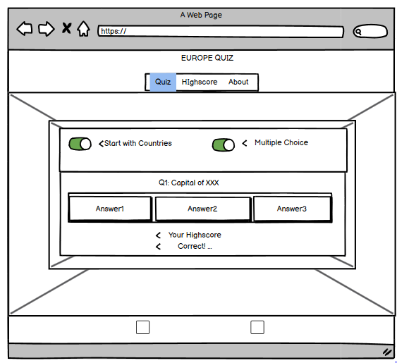

### Tablet Wireframes

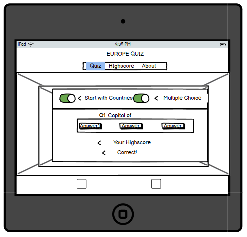
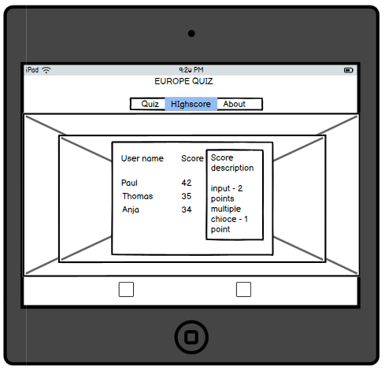

### Desktop Wireframes

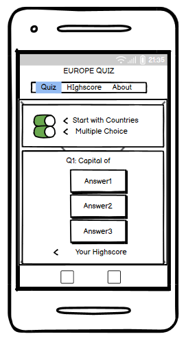
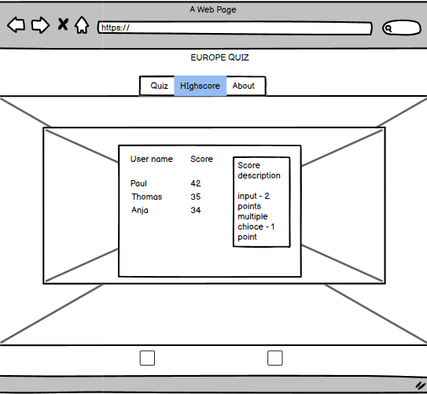

## Testing
- Testing was done in small breaks during the development and at the end of the project
- Validators have been used (see chapter below)
- small feature checks have been made by using preview and the devtools device toolbar
- Tests are done in different browsers such as Edge, Chrome and Firefox
- The responsivness is tested with different screen sizes by using devtools device toolbar
- navigation, header and content of all subpages is readable and easy to understand
- due to testing and small bugs within Gitpod (there was also a version update from basic to pro through out the project) code was transferred in between, which can be seen in the log files on GitHub.

### Bugs (fixed)

| Bug | Description  | images (optional) |
| --- |------------- | ------------- |
| unused variable | The validator showed that an old variable was still in the code | 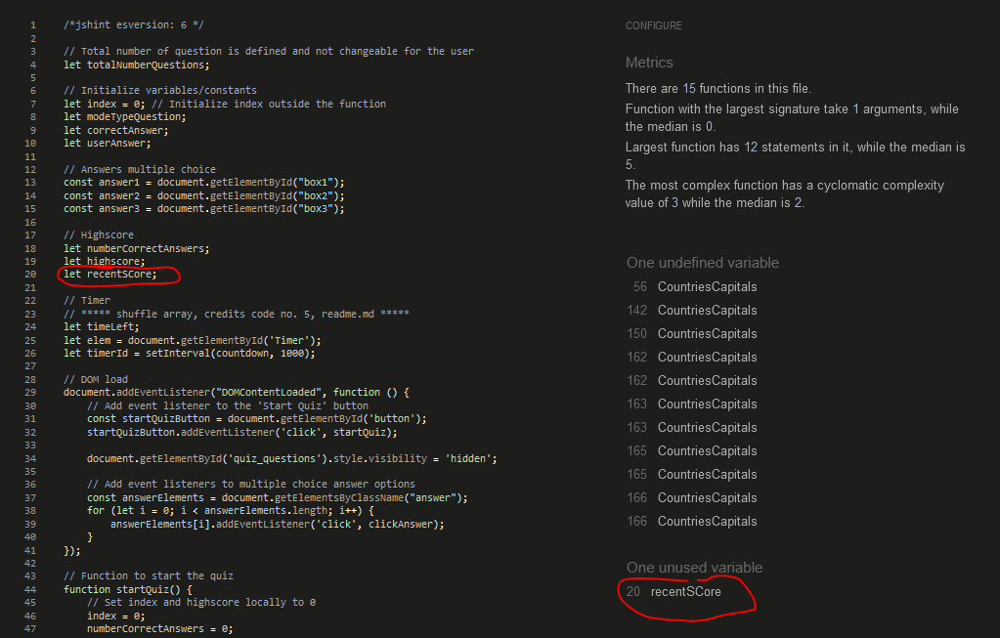 |
| missing semicolon | Due to a missing semicolon the function was not working | 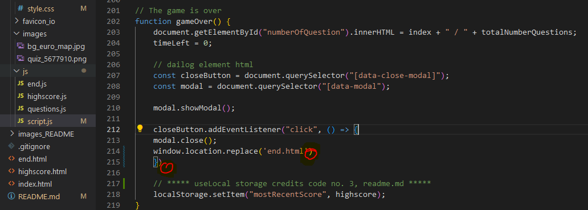 |
| wrong definition of a class element | Symbol # was used instead of . in the stlye.css file. As a consequence of the element 'answer' was not linked with the correct css style. The responsive effect was not working. | 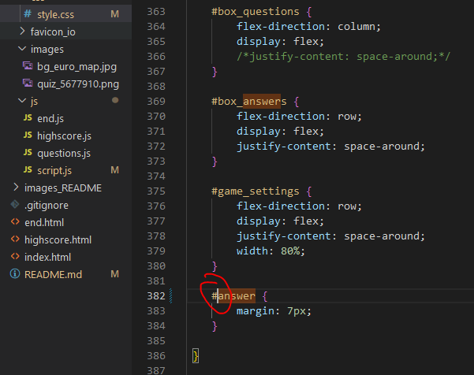 |
| wrong path | One dot to much was added, as a consequence the background image was not visible. The correct amount is 2 (..) | 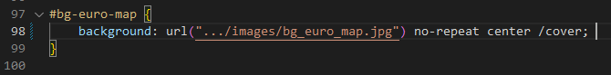 |

### Validator Testing
Validator testing has been done on:

#### [HTML validator](https://validator.w3.org/)

No errors were returned

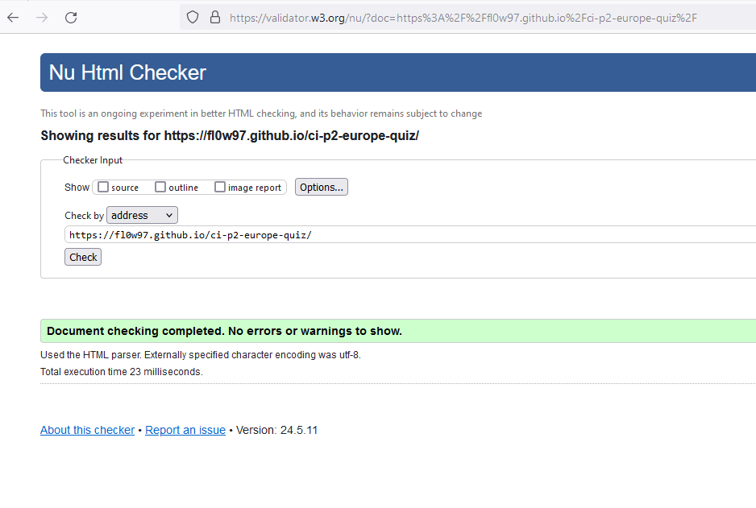

    
further results

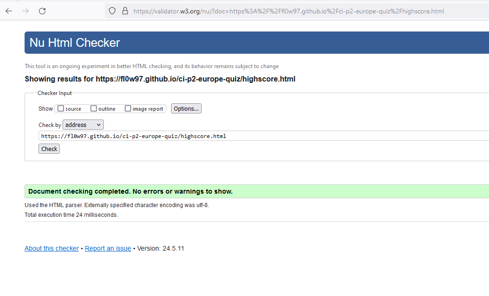
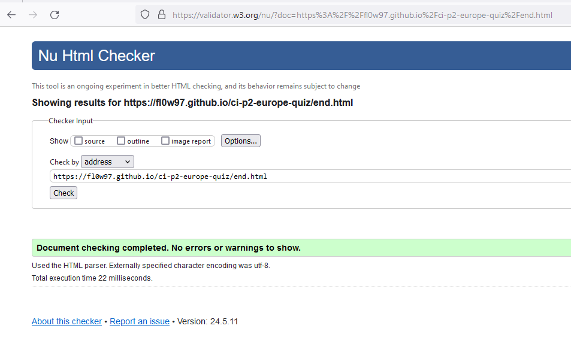

#### [CSS validator](https://jigsaw.w3.org/css-validator/)

No errors were returned

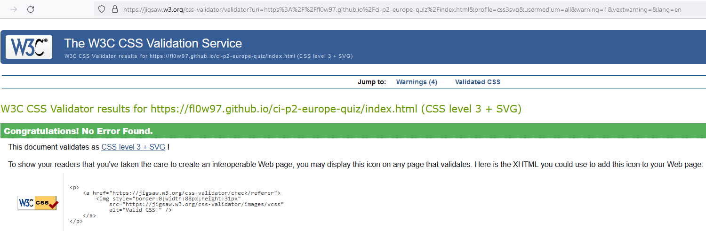

#### [JS Validator] (https://jshint.com/)

No errors were returned

/*jshint esversion: 6 */ was added  in the validator to let the validator recognize variables such as const and let

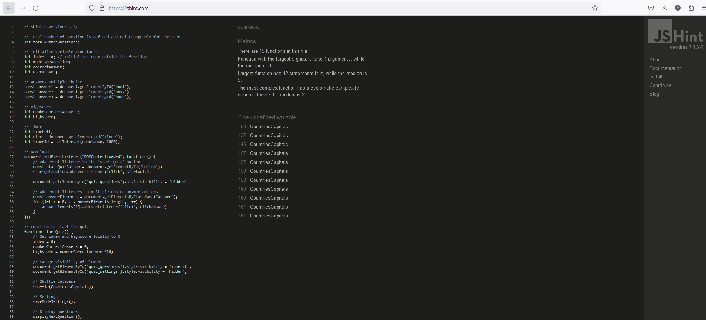

    
further results

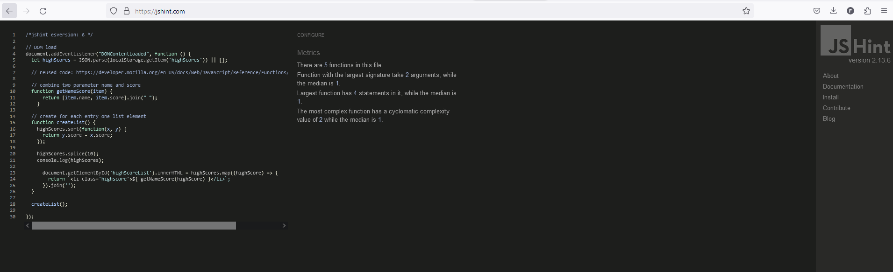
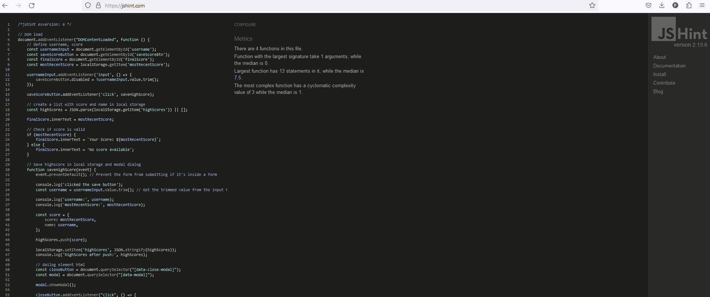

#### Accessability
I confirm that the selected colors and fonts are easy to read and accessible by using Lighthouse in devtools (Chrome).

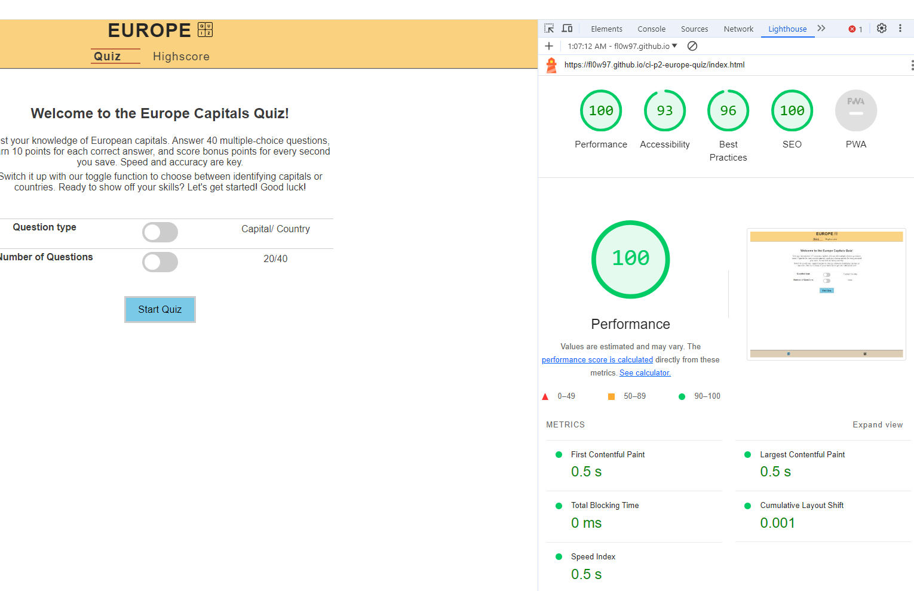

### Unfixed Bugs
(No unfixed bugs.)

## Deployment

The site was deployed to GitHub pages. The steps to deploy are as follows:

- In the GitHub repository, navigate to the Settings tab
- From the source section drop-down menu, select the Main Branch, then click "Save"
- The page will be automatically refreshed with a detailed ribbon display to indicate the successful deployment.

Here the live link:  https://fl0w97.github.io/ci-p2-europe-quiz/index.html

    
Cloning repository

1. Visit the GitHub repository.
2. Find the Code button situated above the file list and give it a click.
3. Choose your preferred cloning method — whether it's HTTPS, SSH, or GitHub and hit the copy button to copy the URL to your clipboard.
4. Launch Git Bash or Terminal.
5. Navigate to the directory where you want the cloned directory to reside.
6. In your IDE Terminal, input the following command to clone the repository:
 git clone https://github.com/Fl0W97/CI_p1_meditation-_website.git
7. Press Enter to create your local clone.

## Tools & Technologies used

- HTML used for the main site content
- CSS used for the main site design and layout
- CSS root variables used for reusable styles throughout the site
- CSS Flexbox used for an enhanced responsive layout
- JavaScript for the dynamic features, quiz, highscore count, etc.
- Git used for version control (git status, git add, git commit)
- GitHub used for secure online code storage
- GitHub Pages used for hosting the deployed front-end site
- Gitpod used for local IDE for development
- [Balsamiq](https://balsamiq.com/wireframes/desktop) used for creating Wireframes
- [Color generator](http://colormind.io/) used for choosing the correct HEX code
- [Favicon.io](https://favicon.io/) used to create the favicon
- [Google Fonts](https://fonts.google.com/) used to search a suitable font and using it
- [Font Awesome](https://fontawesome.com/) used for logo designs (Linkedin, Youtube and GitHub)
- [Color picker](https://coolors.co/image-picker)

## Improvements and ideas for subsequent projects

- extension of the database by adding countries beyond Europe or adding more details to the single capital-country match such as preseident, political system, show geographical location on a map

- storage of scores and user names in a permanent database so that user who use different browsers can compare their scores. In that way the current limitation of the local storage is avoided.

- Let the user choose between multiple choice question and a single input field for answering

- the java script code can be improved and shortened by using more advanced functions and shortcuts

- a music song can be added once there is a new highscore

- offer different time slots to increase/ decrease the difficulty

- a 404 error page can be included

## Credits

### Media

    
icons/ illustrations and images used from [Freepik.com ](https://www.freepik.com/) and [Picjumbo.com](https://picjumbo.com/)

#### Background
    https://www.freepik.com/free-vector/europe-map-vector_333750.htm#fromView=search&page=1&position=26&uuid=89ac68ad-39ad-4ada-9afc-6dc1bfd5c564 (Designed by Freepik)

#### Logo
    https://www.freepik.com/icon/quiz_5677910#fromView=resource_detail&position=6 (Designed by Freepik)

#### Favicon
The favicon was generated using the following graphics from Twitter Twemoji:
- Graphics Title: 1f30d.svg
- Graphics Author: Copyright 2020 Twitter, Inc and other contributors (https://github.com/twitter/twemoji)
- Graphics Source: https://github.com/twitter/twemoji/blob/master/assets/svg/1f30d.svg
- Graphics License: CC-BY 4.0 (https://creativecommons.org/licenses/by/4.0/)

### Content

- https://www.destatis.de/Europa/DE/Thema/Basistabelle/Bevoelkerung.html
-  https://www.youtube.com/watch?v=DFhmNLKwwGw&list=PLB6wlEeCDJ5Yyh6P2N6Q_9JijB6v4UejF&index=8, https://webdesign.tutsplus.com/multiple-choice-quiz-app-with-javascript--cms-107756t

### Code

| No | Description  | Source | URL |
| --- |------------- | ------------- | ------------- |
|1| Generate Markdown file  | GitHUb | https://docs.github.com/en/get-started/writing-on-github/getting-started-with-writing-and-formatting-on-github/basic-writing-and-formatting-syntax
|2| Create a Toggle Switch | w3schools.com | https://www.w3schools.com/howto/howto_css_switch.asp
|3| Use localStorage | Youtube.com | https://www.youtube.com/watch?v=DFhmNLKwwGw&list=PLB6wlEeCDJ5Yyh6P2N6Q_9JijB6v4UejF&index=8
|4| Countdown | Google Search | https://codepen.io/ideaguy1974/pen/pZBBLK
|5| Shuffle an array | Google Search | https://javascript.info/task/shuffle; https://stackoverflow.com/questions/68674385/is-there-a-way-to-randomize-an-array-to-a-certain-length-in-js
|6| Show highscore | Forum stackoverflow.com | https://stackoverflow.com/questions/58572752/how-to-display-this-js-array-in-a-html-list 

further sources for ideas:
move div position:relative - https://www.w3schools.com/cssref/css3_pr_transform.php
make div appear, disapear - https://www.w3schools.com/cssref/pr_class_visibility.php
quiz idea - https://www.youtube.com/watch?v=u98ROZjBWy8
Modal dialog box (better alternative to alert()) - https://www.youtube.com/watch?v=ywtkJkxJsdg

- check documentation of Chris and old feedback from project 1
